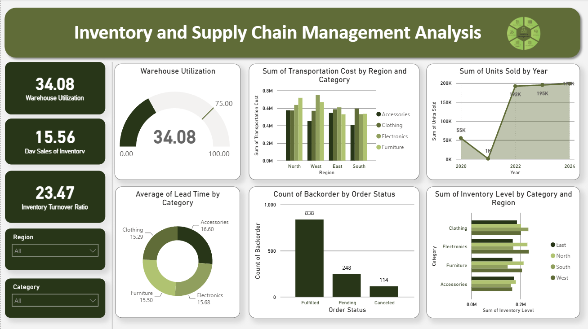

# 📦 Inventory & Supply Chain Management Dashboard

An interactive Power BI dashboard analyzing inventory levels, order fulfillment, and logistics performance across regions, warehouses, and suppliers.

---

## 📊 Overview

This project analyzes **1,200+ orders (2022–2024)** to surface key supply chain KPIs — order accuracy, backorder rate, lead time, and transportation cost — enabling data-driven decisions on warehouse and supplier performance.

## 🖼️ Dashboard Preview

## 📈 Key Metrics

| KPI | Value |
|---|---|
| 🧾 Total Orders | 1,200+ |
| ✅ Order Accuracy | 91.3% |
| ⚠️ Backorder Rate | 9.7% |
| ⏱️ Avg Lead Time | 15.7 days |
| 🚚 Avg Transportation Cost | $7,700+ |
| 🏭 Warehouse Utilization | 34.08% |
| 📦 Day Sales of Inventory | 15.56 days |
| 🔄 Inventory Turnover Ratio | 23.47 |
| 🌍 Regions Covered | 4 |
| 🏢 Warehouses | 3 |
| 🤝 Suppliers | 4 |

## ✨ Features

- Cross-filtering slicers for Region, Category, Supplier, and Warehouse
- Custom DAX measures (`SUM`, `DIVIDE`) for Warehouse Utilization, Day Sales of Inventory, and Inventory Turnover Ratio — see [DAX-Measures.md](DAX-Measures.md)
- Drill-down analysis on 3 years of transactional data
- Visual breakdown of transportation cost, backorders, and inventory levels by region and category

## 🗂️ Dataset

`Inventory_SupplyChain_Dataset.csv` — 1,200 rows, 15 columns:

| Column | Description |
|---|---|
| Date | Order date |
| Region | North / South / East / West |
| Category | Product category |
| Supplier | Supplier A–D |
| Warehouse | Warehouse 1–3 |
| Order Status | Fulfilled / Pending / Canceled |
| Units Sold | Quantity sold |
| Inventory Level | Stock on hand |
| Transportation Cost | Shipping cost (USD) |
| Order Accuracy | TRUE/FALSE |
| Lead Time (Days) | Days from order to fulfillment |
| Backorder | TRUE/FALSE |
| Cost of Goods Sold (COGS) | USD |
| Average Inventory | Average stock level |
| Warehouse Capacity | Max warehouse capacity |

## 🛠️ Tools

- **Power BI Desktop** — data modeling, DAX measures, visuals
- **DAX** — `SUM`, `DIVIDE` for KPI calculations

## 📁 Repository Structure
── Inventory and Supply Chain Management Analysis.pbix   # Power BI dashboard file
├── Inventory_SupplyChain_Dataset.csv                      # Source dataset
├── Dashboard_Overview.png                                 # Dashboard preview image
└── README.md
## 🚀 How to Use

1. Clone the repo
2. Open `Inventory and Supply Chain Management Analysis.pbix` in Power BI Desktop
3. Explore via slicers (Region, Category, Supplier, Warehouse)

## 👤 Author

**Abdul Moiz**
Data Analyst | Power BI • SQL • Python
📧 moiz13072004@gmail.com
🔗 [LinkedIn](https://linkedin.com/in/amabdulmoiz) · [GitHub](https://github.com/AbdulMoiz56)
